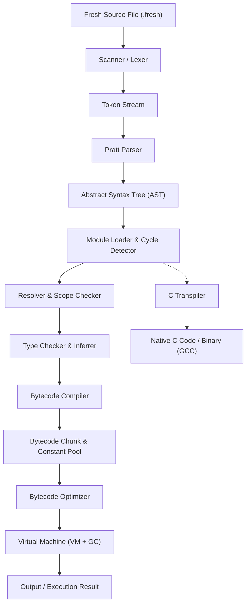

# ⚡ Fresh Programming Language

<p align="center">
  <b>A modern, statically-typed compiled programming language featuring a stack-based Bytecode Virtual Machine, C Transpiler, Pratt Parser, closures, records, pattern matching, multi-file module imports, project packaging, deterministic code formatting, and mark-and-sweep Garbage Collection.</b>
</p>

---

## 📌 Table of Contents

- [Overview](#-overview)
- [Key Features](#-key-features)
- [Architecture Pipeline](#-architecture-pipeline)
- [Installation & Setup](#-installation--setup)
- [Command Line Usage](#-command-line-usage)
  - [Running Scripts (`fresh run`)](#running-a-fresh-script)
  - [Static Analysis (`fresh check`)](#static-analysis--type-checking)
  - [Code Formatting (`fresh fmt`)](#code-formatting)
  - [Project Management (`fresh init` & `fresh build`)](#project-initialization--building)
  - [Automated Testing (`fresh test`)](#running-tests)
  - [Interactive REPL (`fresh repl`)](#-interactive-repl)
- [Compiler Inspection Flags](#-compiler-inspection-flags)
- [Showcase Examples](#-showcase-examples)
- [Project Directory Structure](#-project-directory-structure)
- [Language Guide](#-language-guide)
- [Project Justification & PROS](#-project-justification--pros)
- [Academic Architectural Comparison](#-academic-architectural-comparison)
- [Running Tests](#-running-tests)
- [License](#-license)

---

## 🌟 Overview & Architecture Tiers

**Fresh** is a clean, expressive programming language engineered from scratch in Python 3.11+. It features a single-pass character-by-character scanner, a top-down operator precedence Pratt parser, static type checking with local type inference, an optimizing bytecode compiler, a stack-based Virtual Machine with a `match opcode:` execution loop, an automatic mark-and-sweep Garbage Collector with stress-mode support, a recursive module import resolver with cycle detection (`[E4001]`), and project packaging tools.

### Backend Support Tiers

Fresh provides two execution backends:

- **Tier 1 (Fresh Bytecode VM - Full Language)**:
  Executes the full Fresh language specification, including first-class closures with upvalues, recursive pattern matching with guards (`match`), dynamic arrays, user-defined structs, and modules.
- **Tier 2 (Fresh Native C Backend - Statically Typed Subset)**:
  Compiles Fresh source code into standalone, clean C99 code for native compilation with `gcc`, `clang`, or `msvc`. Guarantees 1:1 observable behavioral parity for functions, structs, loops, arithmetic, and logic. Unsupported language features (such as closures or match expressions) are detected and rejected before emission with deterministic compile-time diagnostics (`[E3001]`).

---

## 🔥 Key Features

- **Lexer & Precise Error Reporting**: Single-pass scanner with exact line and column tracking (`line:col`) and human-friendly source code underline diagnostic error output with standardized error codes (`[E1001]`–`[E4001]`).
- **Pratt Parser & Recursion Safety**: Handles expression syntax using top-down operator precedence (eliminates left-recursion bugs and supports easy operator addition) paired with recursive descent statement parsing and nested recursion depth limiting.
- **Static Type Checking & Local Inference**: Type checker enforces strict type rules for binary/unary operations, function call signatures, and struct fields, while inferring variable types automatically on `let` bindings.
- **Multi-File Module Import System**: Clean `import "module.fresh";` and `import module;` support with relative file resolution, duplicate caching, and circular dependency detection (`[E4001]`).
- **Project & Package Tooling**: Built-in `fresh init <name>` to scaffold new projects with `fresh.toml` manifests and `fresh build` to compile projects to native executables.
- **Deterministic Code Formatter**: Built-in `fresh fmt <file> [--check]` providing standardized, idempotent formatting for all Fresh source files.
- **Bytecode Virtual Machine**: Fast VM executing a custom ~40 opcode instruction set architecture (ISA) with CallFrame stack management and safety bounds checks.
- **Lexical Closures & Upvalues**: First-class functions that capture variables from enclosing scopes using upvalue descriptors.
- **User-Defined Struct Records**: Struct declarations with typed fields, instantiation, and property getter/setter opcodes.
- **Pattern Matching with Guards**: Powerful `match` expressions supporting literal values, variable bindings, wildcards (`_`), and conditional `if` guard clauses.
- **Mark-and-Sweep Garbage Collector**: Automatic GC that traces stack frames, evaluation stack, globals, and upvalues with adaptive heap growth and configurable stress mode (`FRESH_GC_STRESS=1`).
- **C Transpiling Backend & Differential Parity**: Transpiles Fresh AST into standalone C code with type-correct `println` dispatch and struct initializers.
- **Standard Library**: Core built-in functions for console I/O, string/type conversions, math operations, dynamic array manipulation, and File I/O (`read_file`, `write_file`, `file_exists`).

---

## 🏗 Architecture Pipeline



---

## ⚙️ Installation & Setup

### Prerequisites

- **Python 3.11+** installed on your system.
- Optional: **GCC / Clang** for native C compilation.

### Option 1: Quick Local Run

1. **Clone the repository**:
   ```bash
   git clone https://github.com/fresh-lang/fresh.git
   cd fresh
   ```

2. **Set `PYTHONPATH` and run**:
   - **Linux / macOS**:
     ```bash
     export PYTHONPATH=src
     python3 -m fresh --help
     ```
   - **Windows (PowerShell)**:
     ```powershell
     $env:PYTHONPATH="src"
     python -m fresh --help
     ```
   - **Windows (CMD)**:
     ```cmd
     set PYTHONPATH=src
     python -m fresh --help
     ```

### Option 2: Editable Package Installation

You can install `fresh` directly into your Python environment as an executable CLI tool:

```bash
pip install -e .
```

Now you can invoke `fresh` directly anywhere from your terminal:
```bash
fresh --help
```

---

## 💻 Command Line Usage

### Running a Fresh Script
```bash
fresh run examples/01_fibonacci.fresh
```

### Static Analysis & Type Checking
Check syntax, scoping, and types without executing bytecode:
```bash
fresh check examples/01_fibonacci.fresh
```

### Code Formatting
Format Fresh source code deterministically:
```bash
# Format file in place
fresh fmt src/main.fresh

# Check formatting without writing changes (exits 1 if unformatted)
fresh fmt src/main.fresh --check
```

### Project Initialization & Building
```bash
# Initialize a new Fresh project
fresh init my_project

# Build the project into native binary/C artifact
fresh build my_project
```

### Running Tests
Discover and run automated test suites:
```bash
fresh test
```

---

## 💬 Interactive REPL

Fresh includes an interactive Read-Eval-Print Loop (REPL) for quick code testing:

```bash
fresh repl
```

**Example REPL session**:
```fresh
Fresh Programming Language v0.1.0
Type 'exit()' or Ctrl+C to quit.

fresh> let name = "Fresh";
fresh> println("Hello, " + name + "!");
Hello, Fresh!
fresh> fn add(a: int, b: int) -> int { return a + b; }
fresh> add(15, 27)
42
fresh> exit
```

---

## 🔍 Compiler Inspection Flags

Fresh provides detailed inspection flags to examine internal compiler stages:

### 1. Print Lexer Tokens (`--dump-tokens`)
```bash
fresh run examples/01_fibonacci.fresh --dump-tokens
```

### 2. Print Abstract Syntax Tree (`--dump-ast`)
```bash
fresh run examples/01_fibonacci.fresh --dump-ast
```

### 3. Print Disassembled Bytecode (`--disassemble`)
```bash
fresh run examples/01_fibonacci.fresh --disassemble
```

### 4. Transpile to Standalone C Code (`--emit-c`)
```bash
fresh run examples/01_fibonacci.fresh --emit-c
```

---

## 📂 Showcase Examples

The repository includes comprehensive showcase programs located in the [`examples/`](examples/) directory:

1. **`01_fibonacci.fresh`**: Demonstrates recursive & iterative Fibonacci calculations alongside stdlib execution timing.
2. **`02_matrix_multiply.fresh`**: Demonstrates 2D dynamic arrays, nested loops, and matrix multiplication.
3. **`03_quicksort.fresh`**: Demonstrates array mutation, partitioning, and recursive quicksort.
4. **`04_closure_counter.fresh`**: Demonstrates first-class functions, anonymous lambdas, and upvalue scope state mutation.
5. **`05_calculator.fresh`**: Demonstrates pattern matching expressions with conditional guards.
6. **`06_inventory.fresh`**: Demonstrates struct records and dynamic array built-in operations.
7. **`07_stress_suite.fresh`**: Complete end-to-end stress test validating all language features.

---

## 📁 Project Directory Structure

```
NEW_LANG/
├── pyproject.toml               # Project configuration & script entry points
├── README.md                    # Project overview & quickstart
├── LANGUAGE_GUIDE.md            # Complete Fresh Language & Syntax Specification
├── docs/                        # Formal architectural documentation & guides
│   ├── COMPARISON.md            # Academic Architectural Comparison (Python vs C vs Fresh)
│   ├── PROS.md                  # Project Justification & Language Innovations
│   ├── FRESH_SPECIFICATION.md   # Language Grammar & Semantics Specification
│   ├── COMPATIBILITY_AND_VERSIONING.md # Compatibility & SemVer Policy
│   ├── project_guide.md         # Compiler Engineering Roadmap & Feature Matrix
│   └── production_release_guide.md # Multi-Channel Distribution & Release Guide
├── examples/                    # Showcase Fresh programs (01-07)
├── vscode-extension/            # VS Code Extension Package (.vsix source)
├── .vscode/                     # VS Code workspace settings & syntax highlighting
├── src/
│   └── fresh/
│       ├── __init__.py
│       ├── __main__.py          # Entry point for python -m fresh
│       ├── cli.py               # CLI subcommands (run, check, fmt, init, build, test, repl)
│       ├── pipeline.py          # Unified compilation & execution pipeline
│       ├── formatter.py         # Deterministic AST-based code formatter
│       ├── modules.py           # Multi-file module loader & circular dependency detector
│       ├── package.py           # Project packaging & build manager
│       ├── common/              # Common utilities
│       │   ├── span.py          # Source location tracking (Span, SourceFile)
│       │   ├── errors.py        # Diagnostic error hierarchy with source underlines
│       │   └── types.py         # FreshType representations (FreshInt, FreshFloat, etc.)
│       ├── lexer/               # Lexical analyzer
│       │   ├── tokens.py        # TokenType IntEnum and Token dataclass
│       │   └── scanner.py       # Single-pass UTF-8 Scanner
│       ├── parser/              # Syntactic analyzer
│       │   ├── ast.py           # 30+ AST node definitions & ASTPrinter
│       │   └── parser.py        # Pratt parser + recursive descent + recursion protection
│       ├── analyzer/            # Semantic analyzer
│       │   ├── symbols.py       # Symbol and Scope linked hierarchy
│       │   ├── resolver.py      # Variable resolution & control flow scope checker
│       │   └── type_checker.py  # Static type checker & local inferrer
│       ├── codegen/             # Code generation
│       │   ├── opcodes.py       # Opcode IntEnum (~40 instructions)
│       │   ├── chunk.py         # Chunk bytecode container & constant pool
│       │   ├── compiler.py      # AST-to-bytecode compiler & jump patcher
│       │   ├── disassembler.py  # Human-readable bytecode disassembler
│       │   ├── optimizer.py     # Optimization passes (constant folding, peepholes)
│       │   └── c_transpiler.py  # C Code Generator with type-correct println
│       ├── vm/                  # Virtual machine runtime
│       │   ├── value.py         # Value representation & truthiness rules
│       │   ├── frame.py         # CallFrame stack frame structure
│       │   ├── objects.py       # Heap object definitions (ObjClosure, ObjArray, etc.)
│       │   ├── gc.py            # Mark-and-Sweep GC with stress mode support
│       │   └── vm.py            # Main execution engine with bounds safety checks
│       └── stdlib/              # Standard library
│           ├── builtins.py      # Console, conversions, array & file I/O builtins
│           └── math_lib.py      # Math native functions (sqrt, pow, floor, etc.)
└── tests/                       # Complete 14-suite automated test suite (86 tests, 80% coverage)
    ├── conftest.py              # Test runner fixture
    ├── test_all_phases.py       # End-to-end multi-phase compiler tests
    ├── test_examples.py         # Official examples verification tests
    ├── test_spec_conformance.py # Specification contract tests
    ├── benchmarks/              # Throughput and performance benchmarks
    ├── c_backend/               # C backend unit & negative diagnostic tests
    ├── cli/                     # CLI integration tests (run, check, fmt, test)
    ├── diagnostics/             # Adversarial syntax & type error tests
    ├── differential/            # VM vs Native GCC differential parity tests
    ├── fmt/                     # Code formatter idempotence tests
    ├── fuzz/                    # Lexer, parser, and semantic analyzer fuzzing
    ├── gc/                      # GC stress mode, cycles, and upvalue tests
    ├── modules/                 # Multi-file module imports & cycle detection
    ├── optimizer/               # Optimizer equivalence verification tests
    ├── package/                 # Project init and build tests
    └── vm/                      # VM safety & stack bounds tests
```

---

## 📖 Documentation & Guides

- [**Fresh Language Specification (`docs/FRESH_SPECIFICATION.md`)**](docs/FRESH_SPECIFICATION.md): Authoritative language grammar, opcode semantics, and standard library contract.
- [**Fresh Language Guide (`LANGUAGE_GUIDE.md`)**](LANGUAGE_GUIDE.md): Practical tutorial and reference on syntax, types, control flow, functions, structs, and modules.
- [**Compatibility & Versioning Policy (`docs/COMPATIBILITY_AND_VERSIONING.md`)**](docs/COMPATIBILITY_AND_VERSIONING.md): SemVer 2.0 stability rules, standard library guarantees, and deprecation cycle.
- [**Project Justification & PROS (`docs/PROS.md`)**](docs/PROS.md): Architectural motivation, design decisions, and benefits.
- [**Academic Architectural Comparison (`docs/COMPARISON.md`)**](docs/COMPARISON.md): Formal technical comparison of Python vs. C vs. Fresh.
- [**Production Release Guide (`docs/production_release_guide.md`)**](docs/production_release_guide.md): Wheel packaging, standalone distribution, and VS Code extension release.

---

## 🧪 Running Tests & Quality Gates

Fresh includes an extensive automated test suite covering all phases across 14 test modules.

To run the complete test suite with coverage enforcement:

```bash
python -m pytest -v --cov=fresh --cov-fail-under=75
```
*(or via CLI: `fresh test`)*

**Verification**: **86 passing tests** and **80% total branch coverage** covering lexing, parsing, resolution, type checking, optimization, GC cycles, differential VM/native execution, fuzzing, formatting, modules, packaging, benchmarks, and specification conformance.

---

## 📄 License

Distributed under the **MIT License**. See `LICENSE` for more information.
